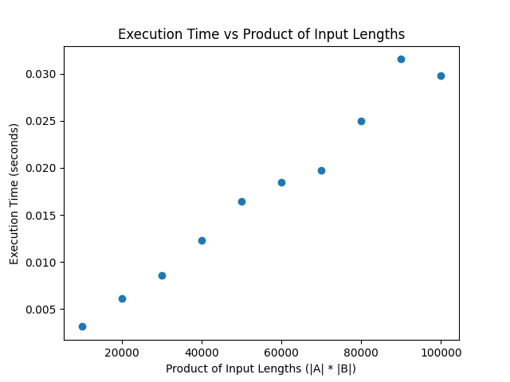

Name: Lane Chin

UFID: 15117678

**Instructions to Run:**

py src/main.py < inputFile

Ex: py src/main.py < examples/example.in

**Assumptions:**

The input contains numerical values for all letters of the alphabet, or they default to value 0.

Strings A and B only consist of lowercase alphabetical characters.

**Question 1.**

The above is the plot with the product of the lengths of A and B on the X axis and the running time of HVLCS on the y axis.

For each point, A was increased by 100 characters and B remained 100 characters long. Hence, for each consecutive point, the product of |A| and |B| increased linearly. We can see in the plot that a line of best fit would be linear. This makes sense as |A| * |B| is increasing linearly.

**Question 2.** 

m is the length of A and n is the length of B

    OPT(i, j) = {
    0                                                                       if i == m or j == n,
    max(value(A[i]) + OPT(i + 1, j + 1), OPT(i + 1, j), OPT(i, j + 1))      if A[i] == B[j],
    max(OPT(i + 1, j), OPT(i, j + 1))                                       otherwise
    }

**Question 3.** 

This algorithm would be extremely similar to the one already implemented. The algorithm will be the same except for the backtrack. In the backtrack, instead of appending the included letter to a string, just track the number of letters and return this number.

    dp = [[0 for _ in range(len(B) + 1)] for _ in range(len(A) + 1)]

    for i in range(m - 1, -1, -1):
        for j in range(n - 1, -1, -1):
            if A[i] == B[j]:
                dp[i][j] = max(values.get(A[i], 0) + dp[i + 1][j + 1], dp[i + 1][j], dp[i][j + 1])
            else:
                dp[i][j] = max(dp[i + 1][j], dp[i][j + 1])

    i, j = 0, 0
    count = 0
    while i < len(A) and j < len(B):
        down = dp[i + 1][j]
        right = dp[i][j + 1]
        diagonal = dp[i + 1][j + 1]
        
        if A[i] == B[j] and diagonal + values.get(A[i], 0) == dp[i][j]:
            count += 1
            i += 1
            j += 1
        elif down >= right:
            i += 1
        else:
            j += 1

    return count

This algorithm runs in O(m * n) time where m and n are the lengths of strings A and B. 
